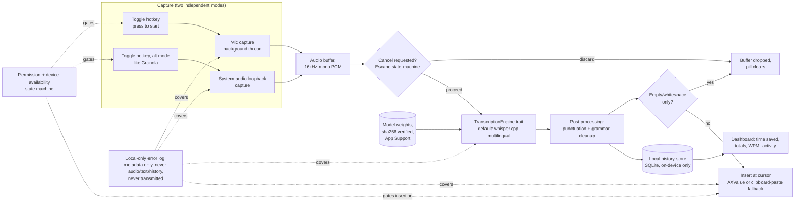

# Mutter — Local Voice Transcription App
### Project Plan for Production Development

**Owner:** Femi Meduna
**Source of truth:** `mutter-idea-dump.md` (your own spec) — this revision supersedes the prior draft, which was written before that file was found. Reference architecture background: `video-breakdown.md` (unverified — see Section 1, note: this file is no longer present in the folder as of the last check).
**Category:** local-first, multi-language speech-to-text with system-audio capture, positioned against SuperWhisper, WhisperFlow, Aqua Voice, Granola.
**Status:** APPROVED
**Mode:** Startup diagnostic run, production framing (not portfolio)

---

## 1. Framing & Honest Premises

**This revision changes one important fact from the first draft.** The diagnostic run before this file was found concluded there was no specific task in mind ("Honestly, no specific moment yet"). Your idea dump names one directly: *"This is going to be super helpful for AI agents so you can use voice commands and type stuff without needing to actually type it manually."* That's a real, concrete use case — dictating to AI coding agents and other tools instead of typing — and it resolves the gap the diagnostic found. I'm updating the record rather than pretending the first pass already had this.

**What still holds from the diagnostic and research:**

- Free, open-source, local-Whisper macOS dictation apps already exist (WhisperDictation, mac-whisper, whisper-mac), and SuperWhisper has a permanent free tier. "No free local option exists" is still false as a reason to build this — but your idea dump doesn't lean on that reason anyway; it leans on wanting a specific, opinionated feature set (multi-language including Yoruba, system-audio capture, local history, an adapter architecture) that none of those alternatives combine.
- "Everything should be absolutely free, zero resources from my end" (your words) independently confirms the earlier premise that no monetization/payment infrastructure belongs in this build. No conflict there.
- Apple shipped systemwide dictation at WWDC 2026, aimed at this category — still worth knowing, still irrelevant to building a personal tool, still relevant again only if this is ever positioned commercially.

**Updated premises (locked in for this revision):**

1. There is now a named, concrete use case (voice input for AI-agent/coding workflows), in addition to general dictation. Demand is still self-only — no evidence yet that anyone besides you needs this — but the "no specific task" gap is closed.
2. "Full production application" still means engineering rigor (signing, CI, crash reporting, auto-update, real error handling), not payment infrastructure — and your idea dump makes this explicit on its own: "there's absolutely no paywall... quite literally."
3. Your idea dump's MVP list is larger than the "minimal viable, ship in weeks" scope from the first draft. This document treats every bullet in your "MVP Requirements" section as real v1 scope, not aspirational — but Section 8's phased roadmap sequences the work honestly rather than pretending it all lands in one pass.
4. The general reference architecture (Tauri + Rust + local ASR) still applies; the source video's specific implementation is still unverified and still not load-bearing here.

---

## 2. Scope — Your MVP Requirements, As Given

Every bullet below is from your idea dump, restated as a build requirement. Where a requirement has a real technical tension (speed vs. multilingual accuracy, for example), that tension is named here and resolved with an explicit decision or an open question — not silently dropped.

| Requirement (your words) | Build requirement | Tension / risk, if any |
|---|---|---|
| "Blazing fast... unbelievable to the user's eye" | Sub-second-feeling latency from hotkey-stop to text appearing, for short-to-medium utterances | Directly in tension with multi-language accuracy (larger multilingual models are slower) — see Section 6 |
| "Fully local, no subscriptions, no limits" | 100% on-device inference, zero network calls after model download | None — this is the easy part; whisper.cpp and Apple's on-device Speech framework both satisfy it |
| "Grammatically correct... fix your punctuation and words" | A real post-processing pass beyond raw ASR output, not just silence-trimming | Needs a decision: rules-based cleanup vs. a small local LLM pass — see Section 3 |
| "Multi-language — Yoruba and most common languages" | English, Yoruba, Spanish, Italian, French, Arabic at minimum | Yoruba is a low-resource language for Whisper; expect materially worse accuracy than the other five unless benchmarked and mitigated — see Section 6 |
| "Local history... copy and paste it when they're recording at any time" | Every transcription persisted locally (SQLite), browsable and copyable from the dashboard | None technically — needs a retention/storage-location decision |
| "Escape/cancel behavior... short timer... hitting escape twice... resume" | A cancel state machine: 1st Escape starts a visible countdown; countdown expiring discards the transcription; a 2nd Escape before it expires aborts the cancellation and resumes | This is a real, specific UX state machine — spec'd in Section 7 |
| "Listen in on the user's speaker... configurable hotkey, like granola" | A second capture mode: system audio loopback (not just mic), for meeting/video transcription | Separate technical path from mic dictation (macOS permission model, capture API) — spec'd in Section 9 |
| "Adapter layers for third-party tools... introduce different LLMs... Apple's ASR or... Nvidia" | A `TranscriptionEngine` trait/interface so the ASR backend is swappable by config, not a rewrite | Architectural pattern, not a plugin marketplace — spec'd in Section 10 |
| "Dashboard... time saved, total transcriptions, WPM" | A metrics view computed entirely from local history, no telemetry involved | None — pure local computation |
| "Super minimal glassmorphic UI... like an Apple product... a widget, not a huge desktop app... the pill" | Two UI surfaces: a floating frosted-glass "pill" HUD for in-progress recording/transcribing/canceling, and a separate glassmorphic dashboard/settings window | Real implementation risk (WKWebView transparency, vibrancy, custom window shape) — named honestly in Section 4, not assumed solved |
| "Ready to be pasted... by clicking the hotkey again" | **Interpretive choice, flagged here:** built as direct auto-insertion at the cursor (Accessibility API), with clipboard + paste as the fallback path — not literal clipboard-only. Auto-insertion is more robust across apps, but it's a real liberty taken against the literal wording, so it's named rather than silently assumed | If you actually want clipboard-only (no direct insertion), say so — it's a smaller, simpler build |
| "Since there's absolutely no paywall... does not need to be built... but the source-of-truth resources / type elements might be needed" | **Unclear, flagged rather than dropped.** Read as: don't build any paywall/billing UI, but keep the data types/interfaces (e.g., a `SubscriptionTier` or `EngineAccess` field) loosely structured enough that a future paid tier wouldn't require a schema rewrite. Not acted on beyond that — confirm this reading is right before Phase 6 | If this meant something else, this plan doesn't yet reflect it |
| "I don't want to use Swift" | No AppKit/Swift anywhere in the stack | Reverses a suggestion from an earlier review pass of this doc (a native AppKit settings panel) — that suggestion is retracted; everything UI-facing stays in Tauri's webview |
| "No failure opportunity... rock solid... no spaghetti code" | Full production-hardening checklist (Section 11) is non-negotiable, not a stretch goal | None — this is the same standard as the first draft, just now applied to a bigger surface area |
| "Everything free, zero resources from my end" | No paid APIs, no cloud inference, no paid infrastructure of any kind | None — consistent with 100% local requirement above |

**Explicitly still deferred (not in your idea dump, not added here):**
- Windows/cross-platform support
- Any payment, account, or licensing system
- A public plugin marketplace (the adapter layer is an internal architecture pattern, not a store)
- Public marketing or wide distribution before the validation gate (Section 12) is met

**Day-0 task, still recommended:** before writing hotkey/model code, spend 30-60 minutes reading WhisperDictation's or mac-whisper's source (hotkey + text-injection implementation specifically). Cheap insurance against reinventing solved plumbing, even on a larger build.

---

## 3. System Architecture

**Flow in words:**

1. **Toggle, not push-to-talk.** Pressing the hotkey once starts capture; pressing it again stops and triggers transcription. (This corrects the first draft, which assumed push-to-talk/hold — your idea dump is explicit: "clicking the same button... again" to stop.)
2. Two independent capture modes share the same downstream pipeline: **mic dictation** (default) and **system-audio loopback** (opt-in, Granola-style, for meetings/videos — Section 9). Only one is active at a time per recording.
3. While recording, an Escape-driven cancel state machine (Section 7) can discard the in-progress buffer with a visible countdown and a resume path. The Escape key hook is installed only for the duration of an active recording/cancel-pending session and torn down immediately after — it must never swallow Escape system-wide while idle, which would break Escape in every other application.
4. On stop, the buffered audio goes to the active `TranscriptionEngine` implementation (Section 10) — whisper.cpp multilingual by default. A duration cap applies (120s mic / 300s system-audio), but hitting it does not truncate speech: the app **auto-transcribes-and-continues** — the buffered segment is transcribed and inserted immediately, a new segment starts automatically (audible cue, brief pill flicker), and the toggle-hotkey session continues uninterrupted. This matters specifically because the primary named use case — dictating a spec or bug report to an AI coding agent — routinely runs past 2 minutes; silently truncating speech at the cap would lose exactly the content that motivated this project. **If a segment's transcription fails** (inference error mid-session), a visible `[transcription failed]` marker is inserted at that point in the text and the error is logged, rather than silently dropping the segment — the user sees exactly where content is missing instead of an unexplained gap, consistent with how every other failure mode in this plan is handled.
5. Raw ASR output gets a real cleanup pass — punctuation and grammar correction, not just silence-trimming (Section 6 covers the local-LLM-vs-rules-only decision this requires).
6. Every transcription is written to a local SQLite history store regardless of what happens downstream — this is what makes "copy and paste it when they're recording at any time" (recovery from a failed paste) actually possible, and it's what feeds the dashboard.
7. If the cleaned result isn't empty, it's inserted at the cursor (AXValue where supported, clipboard-swap + synthetic paste as a fallback for terminals and other custom-drawn text surfaces, restoring the original clipboard afterward) — Accessibility permission is consumed at this step, not at capture start.
8. Inference and capture run on a dedicated background thread — never the UI/hotkey-handling thread, so the pill's "recording/transcribing" states stay responsive regardless of model load.
9. **Crash isolation.** Three native-binding surfaces exist in this pipeline with no memory-safety guarantee from Rust: whisper.cpp via FFI (`whisper-rs`), the ScreenCaptureKit bridge (Section 9), and the Accessibility API. Calls into all three are wrapped in `std::panic::catch_unwind`, converting a Rust-side panic into a recoverable error the permission/error-state machine (Section 11) already handles, rather than taking down the whole app. This doesn't protect against a hard native crash (SIGSEGV) — full protection would require running inference in a separate process — but it's proportionate to the risk for a v1 single-user tool and catches the far more common panic case.
9. Errors anywhere in this pipeline write to a local-only error log (metadata only: timing, error codes, engine/model identifiers, OS version — never audio, transcript, or history content). Nothing here is transmitted anywhere; there is no remote crash-reporting service in v1, consistent with "no data online" as an absolute, not a default-with-opt-out.

---

## 4. UI / Design Spec

Matches your spec directly: minimal, glassmorphic, Apple-like, widget-sized — not a traditional always-open desktop app.

- **No Swift, no AppKit code you write.** Both UI surfaces below are built as Tauri webviews. Tauri's Rust layer calls into macOS's `NSVisualEffectView`-backed vibrancy internally, so you never write Swift/AppKit yourself — that constraint holds. **Named honestly, not assumed solved:** combining transparency, a custom non-rectangular "pill" shape, always-on-top, and vibrancy has real known rough edges in Tauri/wry (WKWebView forces an opaque background unless configured precisely, vibrancy materials render inconsistently across macOS versions, and matching a CSS shape to the native window's shape is a common pain point). This is exactly why the pill's feasibility is a named Phase 0 spike (Section 15) rather than an assumption baked into the schedule — if it proves too rough, a simpler rectangular HUD is the fallback, still with no Swift/AppKit. This retracts a suggestion from the prior review pass of this doc that floated a native AppKit settings panel; that's now explicitly out, per your constraint.
- **Surface 1 — The Pill.** A small, floating, always-on-top, frosted-glass HUD that appears only while a recording/transcription/cancel cycle is active. States: **loading** (first transcription of the app session only — the model is lazy-loading per Section 6's strategy, so the very first use pays real load latency; without this state the first impression of a "blazing fast" app would be unexplained delay), listening (mic or system-audio icon, subtle waveform), transcribing (brief spinner/processing state), canceling (visible countdown timer), done (brief confirmation, then dismiss). Not visible at rest — this is what keeps the app feeling like a widget, not a permanent fixture.
- **Surface 2 — Dashboard/Settings window.** Opened from the menu-bar icon, not permanently on screen. Same frosted-glass aesthetic. Contains: the metrics dashboard (Section 8's table), local transcription history (browsable, copyable, matches "copy and paste it... at any time"), hotkey configuration (separate bindings for mic-dictation mode and system-audio mode), language selection, engine selection (Section 10), permission status, Quit.
- **Menu-bar icon only, no dock presence** — consistent with the widget framing.

---

## 5. Post-Processing: Grammar & Punctuation

Your spec requires more than raw ASR output: *"it'll fix your punctuation and it'll fix your words so it is more accurate."* Two real options, not silently collapsed into one:

- **Option A — rules-based cleanup.** Fast, fully offline, zero extra model weight, but limited: can normalize punctuation and casing, can't meaningfully fix grammar or word choice.
- **Option B — a small local LLM pass** (e.g., a quantized 1-3B instruction model run via `llama.cpp`/`candle`, invoked only on the transcript text, never the audio). Handles real grammar correction and word-choice fixes, at the cost of extra latency (in tension with "blazing fast") and another model download (in tension with a small app footprint).

**Recommendation:** ship Option A in the core pipeline (always-on, cheap, fast) and make Option B a per-transcript, user-triggered "clean up with AI" action rather than always-on middleware — this keeps the default path fast (protects the "blazing fast" requirement) while still delivering real grammar correction when wanted, and it's a natural first real use of the adapter layer in Section 10 (the cleanup step becomes just another swappable engine call). Flagged as an open decision to confirm with you before Phase 3, not committed silently.

**Checked during eng review:** the primary named use case (dictating to AI coding agents) needs precise technical vocabulary preserved, not paraphrased — an always-on LLM cleanup pass would risk corrupting exactly that. The user-triggered-only design above already contains this risk (you'd simply never trigger cleanup on agent-directed dictation) — confirmed as sufficient, no change needed.

---

## 6. Model & Language Plan

- **Default engine:** whisper.cpp, multilingual (not `.en`-only, since English-only models can't serve the other five languages). This is a bigger model than the prior draft's `base.en` — a multilingual `small` or `medium` GGML model is the realistic floor for usable accuracy across English, Spanish, Italian, French, and Arabic.
- **"Blazing fast" is in direct tension with that model size, and needs a named mitigation, not just a benchmark.** A multilingual small/medium Whisper model on CPU/Metal is realistically not sub-second for anything but very short clips — naming the tension isn't enough on its own. **Mitigation:** per-language tiered model routing — a smaller/faster model as the default (e.g., `small`) for languages that test well on it, with `medium` reserved only for languages that specifically need the accuracy (candidate: Yoruba, per below). If Phase 0's benchmark shows even `small` isn't fast enough anywhere, the fallback is accepting a revised, honestly-lower latency target rather than silently keeping "blazing fast" as an unmet requirement — this gets decided with real numbers in Phase 0, not guessed here.
- **Yoruba is the real risk, named honestly.** Whisper's training data for Yoruba is comparatively small (a low-resource language in the original training set), so accuracy will likely be noticeably worse than for the other five languages even on the largest Whisper variant. This isn't a reason to drop the requirement — it's a reason to (a) benchmark Yoruba accuracy specifically in Phase 0 before committing to Whisper as the sole engine, and (b) treat "improve Yoruba accuracy" (fine-tuning, a supplementary dataset, or a different engine for that language specifically) as an explicitly named stretch item rather than an assumed solved problem.
- **A serious alternative worth spiking in Phase 0: Apple's on-device Speech framework (`SFSpeechRecognizer`).** It's free, fully local, ships with macOS, supports many languages out of the box, and needs no model download at all — it may already satisfy "fast + local + multilingual" for several of your six languages without bundling any Whisper weights. The adapter layer (Section 10) means this isn't an either/or: Apple's framework and whisper.cpp can both be registered as engines, with per-language or per-quality routing decided after the Phase 0 benchmark, not guessed now. **Verify on-device-only behavior per language, not assumed.** `SFSpeechRecognizer`'s on-device support is locale-dependent and has historically fallen back to server-based recognition for less common languages — for Yoruba and Arabic specifically, confirm on-device recognition is actually available and used (`recognitionTask` exposes this) before relying on it, since a silent network fallback would violate "zero network calls after model download" as an absolute, not just a preference.
- **NVIDIA Parakeet** (named in your idea dump): built on NeMo, which is CUDA/PyTorch-centric — it doesn't have a natural, lightweight path to Apple Silicon/Metal today. Community ports of Parakeet-family models to Apple Silicon have mostly gone through Apple's **MLX** framework rather than ONNX/CoreML — the adapter layer leaves room for an MLX (or ONNX/CoreML) port if one becomes available, without a rewrite, but it's not a v1 engine candidate for this reason.
- **Delivery:** first-run download, sha256-verified, cached in `~/Library/Application Support/Mutter/models/`. Nothing touches the network afterward.
- **Loading strategy: lazy-load on first use, then kept resident.** The model loads into memory on the first transcription request (not at app launch, to keep cold-start idle memory low) and stays resident for the life of the app process afterward. Reloading from disk on every transcription would add real, avoidable latency directly undercutting "blazing fast" (Section 2) — this decision protects that requirement at negligible extra complexity.
- **OSS/model license compliance** (distinct from the deferred product-licensing/account system in Section 2): whisper.cpp is MIT-licensed; verify Whisper model-weight redistribution terms before any release outside your own machine.

---

## 7. Escape / Cancel State Machine

Directly from your spec, made concrete:

1. **Recording or transcribing** → user presses Escape.
2. **Cancel-pending state begins:** the pill shows a visible countdown (e.g., 3 seconds). Audio capture pauses or continues buffering (decide in Phase 2 — pausing is simpler and matches user intent better).
3. **If the countdown expires:** the buffer is discarded, nothing is transcribed or inserted, the pill clears. This is a real, final cancel.
4. **If Escape is pressed again before the countdown expires:** the cancellation itself is aborted — recording/transcribing resumes exactly where it left off, countdown disappears.
5. This is a small, explicit state machine (`Recording → CancelPending → {Discarded | Resumed}`), not an incidental UI detail — it gets its own unit tests in Phase 2.

---

## 8. Dashboard & Metrics

All computed from the local history store — no telemetry, no network calls, matches "everything local" directly.

| Metric | Computation |
|---|---|
| Time saved | `(word_count / assumed_typing_wpm) − (actual_dictation_duration_seconds / 60)`, result in minutes, summed across history. `assumed_typing_wpm` is a configurable constant (default ~40 WPM), shown as an assumption, not presented as precise fact. Units matter here — mixing minutes and seconds without converting produces wrong (often negative) results |
| Total transcriptions | Count of history rows |
| Words-per-minute (per transcription + rolling average) | `word_count / (duration_seconds / 60)`, per entry and averaged |
| Activity feed | Chronological list of past transcriptions with timestamp, duration, language, engine used, and a copy button (this doubles as the "copy and paste it... at any time" recovery mechanism from your spec). **Paginated** (e.g. 50 rows per page, most-recent-first) rather than loading the full history table at once — this is meant for long-term daily use, so unbounded growth is a real scaling concern, not a hypothetical one |

**Scaling note:** Time-saved, total-count, and WPM-average are maintained as **running aggregates, updated on each history insert** — not recomputed by scanning the whole table on every dashboard open. Small extra bookkeeping on writes, but the dashboard stays fast indefinitely instead of slowing down after months of accumulated history. **Reconciliation:** the running aggregate can drift from ground truth (a crashed write, a manually-edited history row) — a "recompute from scratch" action is available in settings (a full-table scan, acceptable as an occasional manual operation even at large row counts) so drift is always correctable, not a permanent state.

---

## 9. System Audio Capture ("like Granola")

A genuinely separate technical feature from mic dictation, not a small addition — named explicitly so it isn't underscoped.

- **Purpose:** transcribe audio playing through the computer's speakers (meetings, videos) — not what the user says into the mic.
- **Technical approach:** macOS `ScreenCaptureKit`'s audio-capture API (available macOS 13+) is the modern, Apple-provided way to tap system audio output, and is strongly preferred over a third-party virtual audio driver (e.g., BlackHole) — those require separate kernel-extension/driver installation, are community-maintained, and are exactly the kind of fragile dependency the "no failure opportunity, rock solid" requirement argues against.
- **Permission model, heavier than a mic prompt.** `ScreenCaptureKit` requires explicit user consent via the Screen Recording permission family — even for audio-only capture. On modern macOS this surfaces a persistent system recording indicator and periodic re-consent prompts, a much more visible "this app is recording your screen"-flavored UX than a simple mic prompt. This is real friction against the "unobtrusive widget" design goal (Section 4) and needs its own onboarding flow that explains why an audio-only feature triggers a screen-recording-flavored permission, separate from the mic/Accessibility prompts, with its own entry in the permission-state machine (Section 11).
- **Rust-binding path is unverified and needs its own Phase 0 spike** — both the binding mechanism AND the capability shape. `ScreenCaptureKit` is an Objective-C/Swift-native API with no official Rust bindings — a real implementation needs either an `objc2`-based crate bridge or a minimal build-time Objective-C shim (distinct from writing actual Swift source, which stays out per your constraint). Beyond the binding approach itself, confirm the audio-only capability shape is actually clean before committing: no video-frame capture overhead when audio-only is requested, and the exact entitlement/permission scoping for audio-only vs. full-screen capture — this is assumed, not yet verified against Apple's documentation or a real test. This is named explicitly in Section 15's Phase 0 spikes rather than assumed solved alongside the whisper.cpp integration spike.
- **Separate mode, not always-on.** System-audio capture only runs when explicitly toggled (separate hotkey/mode from mic dictation) — both to respect the "no failure opportunity" reliability goal and so the app never captures audio content the user didn't intend to record.
- **Shares the downstream pipeline** (post-processing, history, dashboard) with mic dictation — only the capture source and buffer duration cap (longer, meeting-length) differ.

---

## 10. Adapter / Engine Architecture

From your spec directly: *"build adapter layers for any sort of third-party tools... introduce different LLMs... Apple's ASR or... Nvidia... turning on those options."*

- **Two separate traits, not one** — an architecture review pass caught that a single trait can't honestly serve both roles: `TranscriptionEngine` (Rust): `transcribe(audio_buffer, language) -> Result<Text>`, audio in, text out. `TextProcessor`: `process(text, language) -> Result<Text>`, text in, text out — used by grammar-cleanup (Section 5's Option B). Each interface stays honest about its actual input/output shape instead of forcing callers to pattern-match on a variant.
- **v1 concrete implementations:** `WhisperEngine` (default), and `AppleSpeechEngine` if the Phase 0 benchmark (Section 6) favors it for any of the six languages — both implement `TranscriptionEngine`. Both registered in an engine registry.
- **Language routing is auto-detected, not manually selected.** Whisper's multilingual models support language auto-detection directly from the audio (small overhead on the first fraction of a second of inference) — the per-language engine/model routing decided in Section 6's Phase 0 benchmark happens automatically based on the detected language, invisible to you. Manual per-language settings switching was considered and rejected: for genuinely multilingual/code-switching use (including the Yoruba requirement), opening settings before every non-default-language utterance would directly conflict with "blazing fast... like a widget."
- **Mid-flight engine changes apply immediately.** If the user changes the active engine or per-language routing while a transcription is already in-flight, the current job is aborted and restarted against the newly-selected engine — not left to finish on the stale engine. A deliberate choice (over "in-flight jobs keep their original engine"): settings changes are never silently deferred.
- **Post-processing is behind its own adapter** (Section 5's Option A/B split) — the "clean up with AI" action is a `TextProcessor` implementation, registered and selected the same way as transcription engines, but through its own trait.
- **Explicitly scoped as an internal architecture pattern, not a plugin marketplace or public API in v1.** This keeps "the app can grow new engines by config, not rewrite" true without committing to building and maintaining a third-party plugin ecosystem, which is a different, much larger project than what your spec actually asks for.
- **A typed `EngineError` enum, shared by both traits** (e.g. `ModelNotLoaded`, `UnsupportedLanguage`, `InferenceFailed`, `Timeout`) — not a generic boxed error. This is the same precision the permission-state machine already applies (Section 11's states are all specific and actionable); an untyped error here would be the one place in the pipeline where the pill/error log could only say "something went wrong" instead of something specific and recoverable.

---

## 11. Production Engineering Requirements

Unchanged in standard from the first draft, now applied across the larger feature surface. This is what "full production application" means in practice — the checklist every hobby clone skips.

- **Code signing: ad-hoc for v1, paid notarization deferred — this respects "zero resources from my end."** Apple Developer Program membership ($99/yr) is a real cost, and full notarization isn't needed for a single-user build running on your own machine (a Gatekeeper "Open Anyway" override handles ad-hoc-signed local builds). Ad-hoc signing still gives a stable code-signature identity, which is what actually matters for TCC/Accessibility trust during development (see below). **Only if/when the validation gate (Section 13) is met and the app is meant to leave your machine** does paid Developer ID + `notarytool` notarization become a real Phase 7 item — tracked as a gated future cost, not committed spending now.
- **Permission-state handling as a first-class feature, built as one generic abstraction, not three.** A single generic `PermissionGate<T>` state machine (states: NotRequested / Denied / Granted / Unavailable), parameterized by permission kind and instantiated three times: mic (Unavailable covers none-present, disconnected mid-capture, held by another app), Accessibility, and **system-audio capture** (plus the persistent recording-indicator UX named in Section 9). One implementation and one test suite instead of three hand-rolled state machines — a DRY win that also means a future fourth permission family costs one instantiation, not a new implementation. Every denied/unavailable state gets a recoverable path (deep link to System Settings, or a clear "unavailable" message), never a silent failure.
- **Known Phase 1-3 dev-loop friction:** TCC ties Accessibility (and system-audio) trust to code signature — a *stable* ad-hoc signing identity from Phase 1 onward (the same one used for the v1 release itself, per above) reduces repeated re-approval during development; expect it, don't debug it as a mystery bug.
- **Auto-update, with package-level signature verification.** `tauri-plugin-updater` against a manifest on GitHub Releases, using its built-in Ed25519 update-signing (not custom crypto — a Tauri built-in): a keypair is generated once, the public key is pinned in the app binary, and every release artifact is signed before upload. Updates with a missing or invalid signature are rejected automatically. This matters specifically because the app runs in the background with mic and screen-recording access — HTTPS-to-GitHub alone would leave a real supply-chain gap for a tool with that level of system access, not just a theoretical one.
- **Error logging — local-only, no remote transmission, metadata only.** This is not a remote crash-reporting service (no Sentry or equivalent) — that would be a real ambiguity against "I don't want to send any data online... everything is local," stated as an absolute in your idea dump, not a default-with-opt-out. Errors and panics write to the same local, rotated log file as everything else, containing only timing, error codes, model/engine identifiers, and OS version — never audio, transcript text, or history content. This is a scope reduction from the first draft's Sentry-based design, made specifically to remove both a paid-service dependency and a "does this violate no-data-online" ambiguity in one move.
- **Structured logging.** Local file only (`tracing` crate), rotated, metadata-only, covering the whole app (all engines, both capture modes) — see Section 3's diagram.
- **Local history storage.** SQLite via `rusqlite`, stored under `~/Library/Application Support/Mutter/`, on-device only — no sync, no cloud backup by default (flag as an open question in Section 14 whether local encryption-at-rest is warranted given it may contain sensitive dictated or meeting content).
- **Schema migrations, with a backup-then-migrate failure path.** Since updates ship via auto-update (above) but the local history database persists across versions, use a versioned-migration approach (e.g., the `rusqlite_migration` crate with a schema-version table) from the first release that includes the history feature — retrofitting migrations after users already have real data is the harder path. **Before running any migration, copy the DB file to a timestamped backup.** If a migration fails (disk full, corrupted file, unexpected schema state), the app refuses to launch normally and shows a clear "history database needs attention" screen naming the backup path — never launching against a half-migrated schema or risking silent data loss, since real dictation and meeting history is the failure mode this plan cares most about protecting.
- **CI.** GitHub Actions: Rust unit tests (including the cancel state machine, Section 7), an integration test running fixture audio through the full pipeline per registered engine, and an ad-hoc-signed build on every push to main once signing is wired up.
- **Test strategy** (expanded during eng review — every codepath below traces to a specific plan section):
  - Unit: audio resampling; model loader (checksum + corrupt-file handling, Section 6); `PermissionGate<T>` state machine, all three instantiations (Section 11); each `EngineError`/`TextProcessor` error variant (Section 10); `catch_unwind` panic isolation around whisper-rs/ScreenCaptureKit-bridge calls actually converts a simulated panic into a recoverable error, not a crash (Section 3); hotkey re-entrancy (pressed again while transcribing → ignored, Section 3); recording-duration auto-stop at the 120s/300s caps (Section 3); empty/whitespace transcription result → nothing pasted (Section 3); post-processing cleanup, both Option A (rules) and Option B (local-LLM) paths (Section 5); cancel state machine — both the discard-on-expiry AND resume-on-second-Escape branches (Section 7); dashboard formulas (time-saved, WPM) — explicit unit-conversion correctness given the units bug caught in this review (Section 8); local-history CRUD and copy-from-history recovery (Section 3); migration backup-then-refuse-launch failure path (Section 11); mid-flight engine-change abort-and-restart (Section 10); auto-update signature verification, both valid and invalid/missing-signature cases (Section 11).
  - Integration: fixture audio → transcript per engine, per language where feasible.
  - E2E (`[→E2E]`, per the decision matrix — flows spanning 3+ components or where mocking would hide real failures): full mic-dictation toggle→speak→toggle→text flow; full system-audio meeting-capture flow; permission-denial → recoverable prompt → grant → retry flow.
  - Manual QA matrix: hotkey + text injection across a plain text field, a rich-text editor, and a terminal (AX vs. clipboard-fallback path); mic-dictation and system-audio modes tested independently; all six languages spot-checked for basic functional correctness (not full accuracy benchmarking, which is Phase 0's job); the system-audio recording-indicator UX (Section 9) confirmed visible and understandable in onboarding. **Terminal text-injection is validated FIRST, in Phase 2, not deferred to the Phase 8 manual QA pass** — dictating into a terminal-based AI-agent REPL is the single most load-bearing integration point for the plan's primary named use case, including bracketed-paste-mode and multi-line-handling behavior specific to interactive terminal apps, so it can't be the last thing checked.

---

## 12. Distribution & Release Plan

- **Channel:** ad-hoc-signed `.dmg` via GitHub Releases (Gatekeeper "Open Anyway" override for a single-user local install — see Section 11); `tauri-plugin-updater` against a manifest in the same release. Paid Developer ID notarization is deferred until/unless the validation gate is met and the app is meant to leave your machine.
- **Not the Mac App Store, deliberately.** App Store sandboxing restricts the Accessibility-API text injection and system-audio capture this app depends on for its core features.
- **v1 is a single-user release** — installed on your own machine from a signed build. No public listing until the validation gate below is met.

---

## 13. Validation Gate & Success Criteria

**v1 is "working" when:**
- The full pipeline (toggle-start → capture → transcribe → insert) works reliably across the manual QA matrix (Section 11), for both mic and system-audio modes.
- Successful-completion rate (no crash or unhandled error), measured locally per transcription attempt, holds at ≥99% over real daily use.
- Latency from toggle-stop to text appearing feels "blazing fast" to you personally — no fixed number yet; benchmark real numbers in Phase 0 and set a concrete target once the engine/model choice (Section 6) is settled.
- The Escape/cancel state machine behaves correctly under real use, not just unit tests.

**The validation gate — before any scope expansion, monetization, or public distribution:**
- You use it for real dictation and/or meeting capture, unprompted, at least once a day for two consecutive weeks, without reverting to typing or another tool.
- If that holds: real behavioral evidence exists — worth revisiting wider distribution or the deferred items in Section 2.
- If it doesn't: cheaper to learn now than after building further on top of an unused foundation.

**Explicit non-goals for v1:** any payment or account system, any public plugin marketplace, public marketing, App Store submission, paid Apple notarization (deferred past this gate — see Section 11).

---

## 14. Open Questions

- **Grammar cleanup (Section 5):** confirm the Option A (always-on rules) + Option B (user-triggered local-LLM pass) split before Phase 3, rather than assuming it.
- **Engine choice per language (Section 6):** Whisper multilingual vs. Apple's Speech framework — resolve via a Phase 0 benchmark across all six languages, with Yoruba accuracy specifically called out in the results.
- **Local history encryption at rest:** given meeting transcripts and dictated content may be sensitive, decide before Phase 2 whether the SQLite store needs on-disk encryption, or whether OS-level disk encryption (FileVault) is treated as sufficient.
- **Cancel-state audio handling:** pause capture vs. keep buffering during the cancel-pending countdown (Section 7) — small decision, affects Phase 2 implementation.
- **whisper.cpp integration path:** `whisper-rs` bindings vs. CLI shell-out vs. raw FFI — Phase 0 spike.
- **Exact model-weight redistribution terms** for whichever multilingual model size is chosen — verify before any release outside your own machine.

---

## 15. Phased Roadmap

| Phase | Deliverable | Focus |
|---|---|---|
| **0. Setup + spikes** | Repo scaffold; Tauri boots; Day-0 OSS read-through (Section 2); engine benchmark — Whisper multilingual (small vs. medium, per-language) vs. Apple Speech framework across all six languages, Yoruba accuracy and real latency numbers specifically measured; glassmorphic pill window feasibility check in Tauri (transparency/vibrancy/custom-shape risk named in Section 4); **ScreenCaptureKit Rust-binding spike** (`objc2`-based crate vs. a minimal build-time Objective-C shim — distinct from writing Swift source) | Resolve the real open technical questions, including two now-named integration risks, before committing architecture |
| **1. Core loop** | Toggle hotkey, mic capture, chosen default engine, insert-at-cursor (AX + clipboard fallback), pill UI states (listening/transcribing/done); **stable ad-hoc signing identity established here**, not Phase 7 — Section 11 already notes it's needed "from Phase 1 onward" to avoid repeated TCC re-approval, so the roadmap now matches that | The functional core — mic dictation working end-to-end |
| **2. Cancel + history** | Escape/cancel state machine (Section 7) with tests; SQLite local history; copy-from-history recovery; **terminal text-injection validated here** (bracketed-paste-mode, multi-line handling) rather than deferred to Phase 8, since it's the primary use case's actual target surface | Two of your named MVP requirements, built as first-class features, plus early validation of the highest-risk integration point |
| **3. Multi-language + grammar** | All six languages wired through the chosen engine(s); Section 5's grammar-cleanup decision implemented | The multilingual requirement, plus real post-processing quality |
| **4. System-audio capture** | Granola-style capture mode, its own permission flow and hotkey, sharing the core pipeline | The Granola-style feature, scoped as its own real component |
| **5. Dashboard** | Metrics view (time saved, totals, WPM, activity), settings window, engine/language selection UI | The visible payoff surface, built on data the pipeline already produces |
| **6. Adapter formalization** | `TranscriptionEngine` trait finalized across all implementations used so far; engine selection wired to settings | Locks in "swap by config, not rewrite" as a real, tested property, not just an intention |
| **7. Production hardening** | Signed auto-update, CI, structured logging, SQLite schema migrations, full three-permission-family error handling (ad-hoc signing itself moved to Phase 1 — see above) | The non-negotiable "production" work — paid notarization deferred (see Section 11) |
| **8. Polish + validation** | Full manual QA pass, ad-hoc-signed `.dmg` release, two weeks of real daily use against Section 13's gate | Ship something you'll actually keep using, then prove it |

**Honest scope note:** this is a real multi-phase build, not a weekend project — every phase maps to a requirement you stated directly, none are padding. Phase 0's benchmark results will materially affect how much of Phases 3 and 6 are needed (if Apple's Speech framework alone covers most languages well, the adapter layer gets simpler; if not, Whisper carries more weight). Sequencing is designed so each phase produces something usable, rather than a long stretch with nothing working until the very end.

**Phase 0 is a fork, not a checkpoint.** If Apple's Speech framework wins the benchmark outright across all six languages, most of Phase 3's GGML model-routing/sha256/tiered-model machinery becomes unnecessary, and Phase 6's adapter payoff shrinks to a single concrete engine. If Whisper wins, the `AppleSpeechEngine` implementation work is skipped entirely. Re-scope Phases 3 and 6 concretely based on the actual Phase 0 result before starting them — don't treat Phases 1-8 as one committed sequence regardless of what Phase 0 finds.

---

## 16. Risks & Notes

- **Yoruba accuracy is the single most likely place this plan's ambition and reality diverge** — named honestly in Section 6 rather than assumed away. Budget real Phase 0 time for it.
- **System-audio capture is a genuinely separate technical component**, not a small addition to mic dictation — treat its permission model and capture API as their own risk area, on par with Accessibility permission friction.
- **Permission UX now spans three families** (mic, Accessibility, system-audio) instead of two — proportionally more surface area for the "most likely place to lose time" risk named in the first draft.
- **Local history is new sensitive data at rest** — meeting transcripts and dictated content living in a local database is a real privacy consideration even though nothing leaves the machine; resolve the encryption-at-rest question (Section 14) deliberately, don't default into an answer.
- **Scope discipline still matters even though scope grew.** The adapter layer is an internal pattern, not an invitation to build a plugin store; grammar cleanup gets one clear default behavior, not a menu of five NLP options. Every requirement in Section 2 is real scope; anything beyond that list is still out.
- **No monetization or platform-risk conflict exists in this revision** — your idea dump independently confirms "everything free," so premise #2 was never actually in tension with what you want built. The one real cost tension found in review (paid Apple notarization vs. "zero resources from my end") is resolved by deferring notarization past the validation gate — see Section 11.
- **ScreenCaptureKit's permission UX works against the "unobtrusive widget" design goal.** A persistent system recording indicator for an audio-only feature is a real, named UX cost (Section 9) — not fixable, just worth expecting rather than discovering mid-build.
- **"Blazing fast" and multilingual model accuracy are in real tension, not just named-and-ignored.** Section 6's per-language tiered-model mitigation is the working plan, but Phase 0's actual latency numbers may still force a revised target — treat the current "blazing fast" language as an aspiration to test, not a guaranteed outcome.

---

## 17. The Assignment

Two things, in order:

1. **Before any code:** run the Phase 0 engine benchmark yourself, informally — try Apple's built-in dictation (System Settings → Keyboard → Dictation) against all six languages, especially Yoruba, and note where it already feels "blazing fast" and accurate versus where it clearly struggles. This costs zero build time and directly de-risks the biggest open question in this plan (Section 6) before a single line of Rust exists.
2. **Then:** spend 30-60 minutes reading WhisperDictation's or mac-whisper's hotkey/text-injection source, as in the first draft — still cheap insurance against rebuilding solved plumbing, regardless of how large the rest of the app has grown.

---

## 18. What I Noticed About How You Think

- Your idea dump names a real, specific use case ("AI agents... voice commands") that the diagnostic conversation didn't surface — you had it written down but the structured questions didn't reach it. Worth remembering for next time: the freeform version of your thinking sometimes carries information the multiple-choice version doesn't.
- You gave an honest, weak-looking first answer in the diagnostic ("It's for me, first," "Just typing") rather than a polished one — and then, separately, you'd already written a much more specific and ambitious spec. Both were true at the same time; neither cancels the other out.
- Your idea dump is unusually precise about UX details most people leave vague — the two-stage Escape/cancel behavior, "like granola" as a one-phrase spec for an entire capture mode, "no Swift" as a hard constraint with a stated reason. That precision is what made this revision possible to write concretely instead of guessing.
- You interrupted the review process once ("Stop the process") and then directed a full rewrite against a source document I hadn't seen — both are the same instinct: correcting the plan against reality rather than letting either the diagnostic's momentum or my first draft's assumptions stand uncorrected.

---

## 19. NOT in Scope (Eng Review)

Considered during this review and explicitly deferred, with rationale:

| Item | Rationale |
|---|---|
| Windows/cross-platform support | Already deferred in Section 2 — v1 is macOS-only by explicit scope |
| Public plugin marketplace | Already deferred in Section 10 — the adapter layer is an internal pattern, not a third-party ecosystem |
| Full process-isolated inference (separate OS process, not just `catch_unwind`) | Considered in Architecture Issue 3 as the more-robust alternative; rejected for v1 as disproportionate to a single-user tool's risk — `catch_unwind` covers the common panic case |
| NVIDIA Parakeet / MLX engine port | Logged to TODOS.md — no clean Apple Silicon path exists today; revisit if an MLX port appears |
| Deferring most production hardening past the validation gate (the outside voice's central recommendation) | Explicitly considered and rejected — you reaffirmed "full production application" as the bar before the gate, not after |
| Full accuracy benchmarking across all six languages (vs. functional spot-checks) | Deferred to post-v1 — Phase 0's benchmark is directional (pick an engine/model), not a rigorous accuracy study |

## 20. What Already Exists (Reuse Check)

- **WhisperDictation, mac-whisper, whisper-mac** (open-source GitHub projects) — free, local, whisper.cpp-based macOS dictation apps solving the same hotkey+injection plumbing this plan builds from scratch. The plan already reuses this via the Day-0 task (Section 2): read their source before writing your own hotkey/injection code, rather than reinventing blind.
- **`tauri-plugin-global-shortcut`, `tauri-plugin-updater`** — maintained Tauri plugins already chosen (Section 4/11) instead of hand-rolling OS hotkey registration or a custom update mechanism. `tauri-plugin-updater`'s built-in Ed25519 signing (added in this review) is a Tauri built-in, not custom crypto.
- **`whisper-rs`, `rusqlite`, `rusqlite_migration`** — established crates already chosen over hand-rolled FFI bindings, a hand-rolled SQLite wrapper, or a hand-rolled migration system.
- **Apple's `SFSpeechRecognizer`** — a free, built-in, on-device alternative to bundling Whisper weights at all, already named as a serious Phase 0 candidate (Section 6) rather than assuming Whisper is the only option.
- **macOS's native Accessibility API and `ScreenCaptureKit`** — used directly rather than a third-party virtual-audio-driver (BlackHole) for system-audio capture, explicitly rejected in Section 9 as a more fragile dependency than the Apple-provided path.

All reuse opportunities identified during this review were already reflected in the plan or added as fixes above — no unnecessary rebuilding found.

## 21. Failure Modes (Critical Gaps Check)

For each new codepath, one realistic production failure and its current coverage:

| Codepath | Failure scenario | Test? | Error handling? | User sees |
|---|---|---|---|---|
| Whisper/Apple Speech inference | Model file corrupted, OOM, unsupported language | Yes (EngineError variants, Issue 5) | Yes (typed enum) | Specific, actionable error |
| whisper-rs FFI / ScreenCaptureKit bridge | Native panic | Yes (Issue 3) | Yes (`catch_unwind`) | Recoverable error, not a crash |
| SQLite schema migration | Fails mid-migration (disk full, corruption) | Yes (Issue 6) | Yes (backup + refuse-launch) | Clear recovery screen, backup path named |
| Auto-update package | Invalid/missing signature | Yes (Issue 2) | Yes (rejected automatically) | Update silently skipped, no risk exposure |
| Duration-cap segment | Inference fails on an auto-continued segment | Yes (this section's fix) | Yes (visible marker) | `[transcription failed]` inline, not a silent gap |
| Mic/Accessibility/system-audio permission | Denied or unavailable mid-session | Yes (`PermissionGate<T>`, Issue 4) | Yes | Recoverable prompt or clear "unavailable" message |
| Dashboard aggregate | Drifts from ground truth (crashed write, manual edit) | Partial (manual recompute action exists; no automated drift-detection test yet) | Yes (recompute action) | Correctable via settings, not automatically detected |

**No critical gaps remain** (no failure mode with zero test AND zero error handling AND a silent user-facing outcome) — the one partial item (dashboard aggregate drift-detection) has a manual recovery path even without automated detection, so it doesn't meet the critical-gap bar.

## 22. Implementation Tasks

Synthesized from this review's findings. Each task derives from a specific
finding above. Run with Claude Code or Codex; checkbox as you ship.

- [ ] **T1 (P1, human: ~20min / CC: ~5min)** — core/engine — Split `TranscriptionEngine` into two traits (audio→text) and `TextProcessor` (text→text)
  - Surfaced by: Architecture Issue 1 — single-trait signature can't serve both transcription and text-cleanup
  - Files: Section 10
  - Verify: trait definitions compile with both a `WhisperEngine` (TranscriptionEngine) and a cleanup implementation (TextProcessor) satisfying distinct signatures
- [ ] **T2 (P1, human: ~1hr / CC: ~10min)** — release/signing — Enable Ed25519 update signature verification in `tauri-plugin-updater`
  - Surfaced by: Architecture Issue 2 — unverified auto-update is a supply-chain gap for a mic/screen-access background app
  - Files: Section 11
  - Verify: an update package with an invalid/missing signature is rejected in a manual test
- [ ] **T3 (P2, human: ~1-2hr / CC: ~15min)** — core/ffi — Wrap whisper-rs and ScreenCaptureKit-bridge calls in `catch_unwind`
  - Surfaced by: Architecture Issue 3 — three native-binding surfaces with no crash isolation
  - Files: Section 3
  - Verify: a simulated panic inside a wrapped call surfaces as a recoverable `EngineError`, not an app crash
- [ ] **T4 (P2, human: ~1hr / CC: ~10min)** — core/permissions — Implement generic `PermissionGate<T>` shared by mic/Accessibility/system-audio
  - Surfaced by: Code Quality Issue 4 — DRY violation across three near-identical permission state machines
  - Files: Section 11
  - Verify: one test suite covers all three instantiations
- [ ] **T5 (P2, human: ~30min / CC: ~5min)** — core/engine — Define typed `EngineError` enum shared by `TranscriptionEngine` and `TextProcessor`
  - Surfaced by: Code Quality Issue 5 — untyped engine errors contradict the plan's own recoverable-error-state precedent
  - Files: Section 10
  - Verify: each variant (`ModelNotLoaded`, `UnsupportedLanguage`, `InferenceFailed`, `Timeout`) maps to a specific UI message
- [ ] **T6 (P1, human: ~1hr / CC: ~10min)** — storage/history — Backup-then-migrate with refuse-to-launch on migration failure
  - Surfaced by: Test Issue 6 — no failure path specified for a failed SQLite schema migration
  - Files: Section 11
  - Verify: a simulated migration failure produces a backup file and a recovery screen, not a launch against a broken schema
- [ ] **T7 (P3)** — core/engine — Abort-and-restart in-flight transcription on mid-flight engine change
  - Surfaced by: Test Issue 7 — unspecified behavior when settings change during an in-flight transcription
  - Files: Section 10
  - Verify: changing engine mid-inference aborts and restarts against the new engine
- [ ] **T8 (P2, human: ~15min / CC: ~2min)** — core/engine — Lazy-load model on first use, keep resident for app lifetime
  - Surfaced by: Performance Issue 8 — reload-per-transcription would undercut the blazing-fast requirement
  - Files: Section 6
  - Verify: first transcription pays load latency (shown via the pill's loading state), subsequent ones don't
- [ ] **T9 (P2, human: ~1-2hr / CC: ~15min)** — ui/dashboard — Paginate activity feed, maintain running aggregates with a manual recompute action
  - Surfaced by: Performance Issue 9 — unbounded history queries won't scale for long-term daily use
  - Files: Section 8
  - Verify: dashboard load time stays flat as history grows past a few thousand rows (simulated)
- [ ] **T10 (P1, human: ~30min / CC: ~5min)** — core/capture — Auto-transcribe-and-continue at duration cap instead of truncating
  - Surfaced by: Outside voice — 120s cap silently truncated the primary AI-agent-dictation use case
  - Files: Section 3
  - Verify: a recording held past the cap produces multiple inserted segments, not a truncated one
- [ ] **T11 (P2, human: ~20min / CC: ~5min)** — core/engine — Auto-detect language instead of manual per-language settings switch
  - Surfaced by: Outside voice — manual language switching conflicts with blazing-fast widget UX
  - Files: Section 10
  - Verify: dictating in a non-default language produces correct output with no settings change
- [x] **T12 (P1)** — core/capture — Validate terminal text-injection in Phase 2, not deferred to Phase 8
  - Surfaced by: Outside voice — highest-risk integration point (AI-agent REPL dictation) was tested last
  - Files: Section 15
  - Verify: dictation into an interactive terminal REPL works correctly (bracketed-paste-mode, multi-line) before Phase 3 begins
  - **Done 2026-08-30** (later than the plan wanted, but done): validated via the injection path directly (`debug_test_injection`, not full mic-to-text dictation — see CLAUDE.md) against a real Terminal window. Multi-line text landed as literal text in one paste, bracketed-paste respected, not executed line-by-line.
